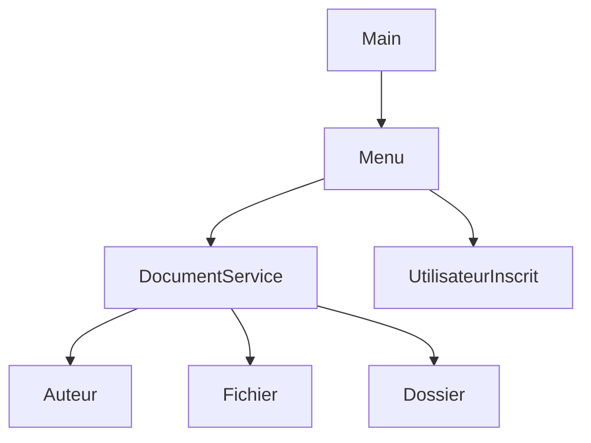

# Java Document Management System

A console-based document management application developed in Java using object-oriented programming principles and modular design.

## Project Objective

This project was designed to simulate a structured document management environment capable of:

- Creating and organizing documents
- Managing folders (Dossiers)
- Handling registered users
- Navigating through a menu-driven interface

The primary objective was to apply clean OOP architecture and separation of responsibilities within a real application structure.

## System Architecture

The system follows a layered modular structure:

- `Auteur` → Represents document authors
- `Fichier` → Represents individual documents
- `Dossier` → Folder management
- `DocumentService` → Business logic layer
- `Menu` → User interaction layer
- `Main` → Application entry point

  ## Architecture Overview

## Technical Concepts Applied

- Object-Oriented Programming (Encapsulation, Abstraction)
- Service layer pattern
- Separation of concerns
- Modular structure
- Clean class responsibility distribution

## Technologies

- Java
- OOP Design
- Console-based interface

## Compilation

Compile:

javac *.java

Run:

## Author

Ojong Bessong NKONGHO  
BSc Computer Science & Engineering
